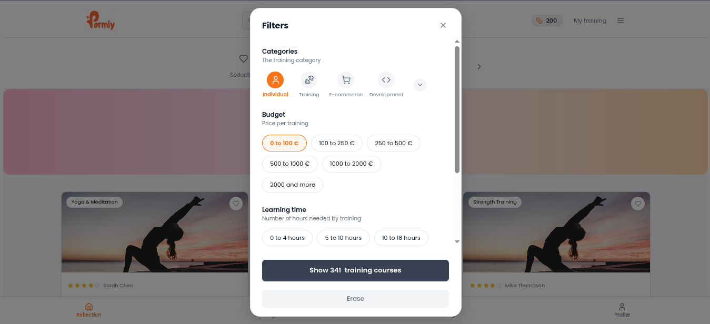
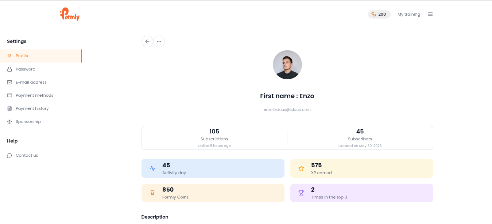

# Project Documentation

## Images

Below are some screenshots and images related to the project:

<p float="left">
  
  
  
</p>

## Overview
This project is a test for a mission with React Native and Expo. Its main objective is to validate and demonstrate the required functionalities and logic that would be used in a real mission context. The codebase includes components and modules that simulate or test critical operations, ensuring reliability and accuracy before deployment.

## Getting Started

### Prerequisites
- [Node.js](https://nodejs.org/)
- [npm](https://www.npmjs.com/)

### Installation

1. Install project dependencies:
    ```bash
    npm install
    ```

### Running the Project

Start the development server:
```bash
npm run dev
```

This will launch the application at localhost:5173. 

## Note
This project is not intended for use in production, but rather as a preparatory step for the deployment of the mission.
